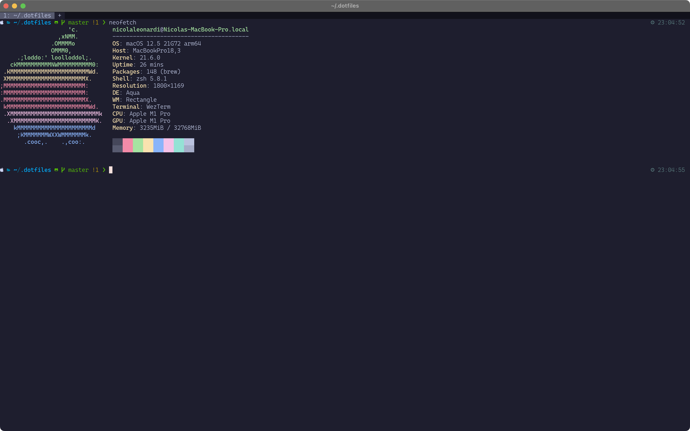
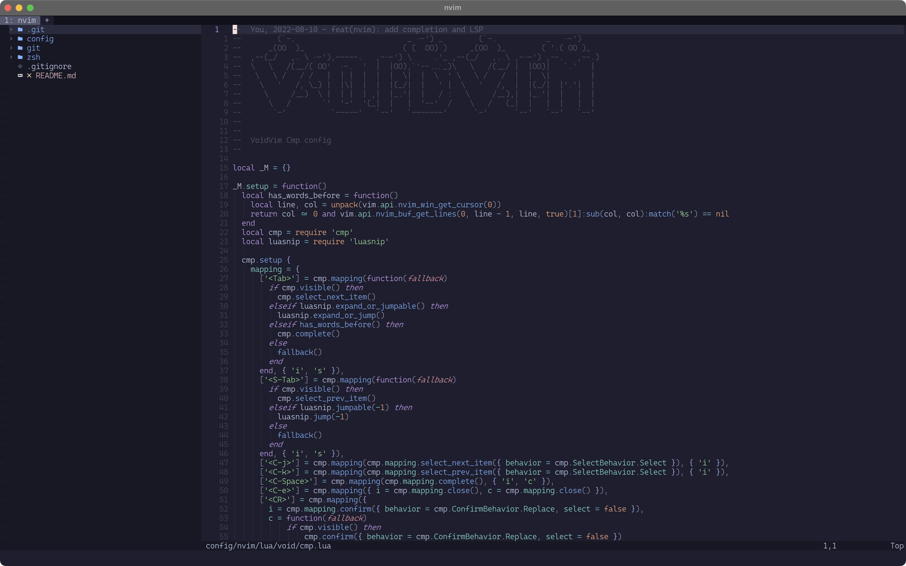

<h1 align='center'>Welcome to the wasted land of dotfiles 🔥</h1>
---




Shame, shame on you, who decided to format (again) your pc.

#### Basics
First thing, first, right? So let's start with [Homebrew installation](https://brew.sh)

Then we should install some dependencies:

```bash
brew install \
	stow \
	neovim \
	ripgrep

brew install --cask \
	dotnet-sdk \
	docker \
	wezterm
```

#### Stow back
Let's clone this repo, and link some configs

```bash
git clone https://github.com/titanzero/dotfiles.git .dotfiles
cd .dotfiles
mkdir -p ~/.config #Ensure config folder exists, not guaranteed on fresh installs
stow config -t ~/.config
stow git
stow zsh
```

#### NeoVim
No more cloning of packer. Just start nvim and everything will be installed automagically!
